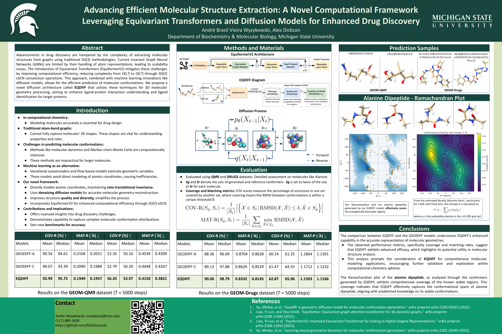

# EQDIFF
Advancements in drug discovery are hampered by the complexity of extracting molecular structures from graphs using traditional SO(3) methodologies. Current invariant Graph Neural Networks (GNNs) are limited by their handling of atom representations, leading to scalability issues. The introduction of Equivariant Transformers (EquiformerV2) mitigates these challenges by improving computational efficiency, reducing complexity from O(L⁶) to O(L³) through SO(2) eSCN convolution operations. This approach, combined with machine learning innovations like diffusion models, allows for the efficient prediction of molecular conformations. We propose a novel diffusion architecture called EQDIFF that utilizes these techniques for 3D molecular geometry processing, aiming to enhance ligand-protein interaction understanding and ligand identification for target proteins.

## Animation

<video autoplay muted playsinline controls>
  <source src="https://github.com/andrewyzy/EQDIFF/raw/main/animation.mp4" type="video/mp4">
</video>

## Poster

## Contact

* André Wyzykowski: wyzykow2@msu.edu , abvwmc@gmail.com
*  (517) 980-1839
*  https://github.com/ADicksonLab

